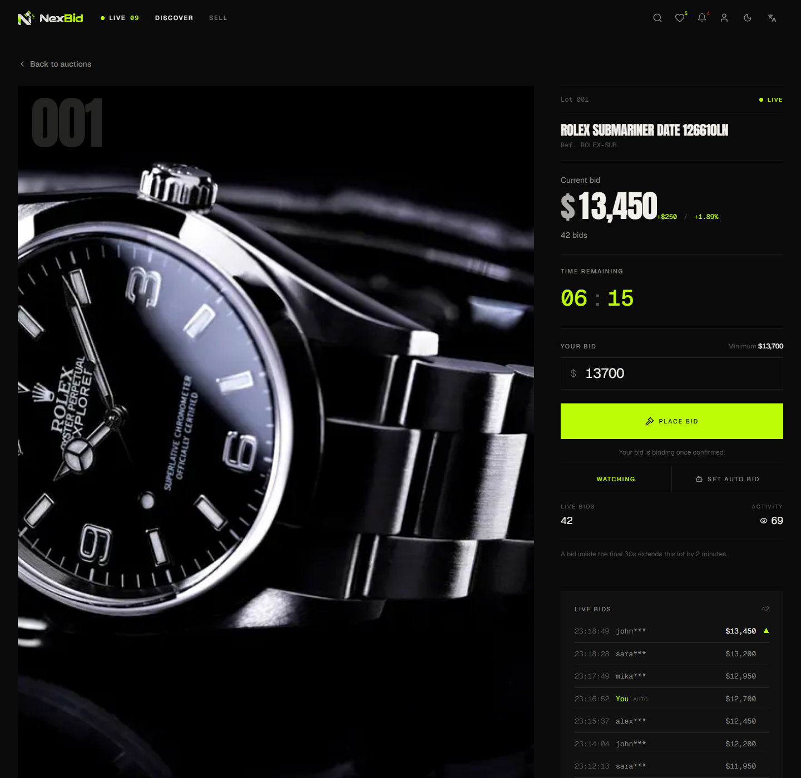
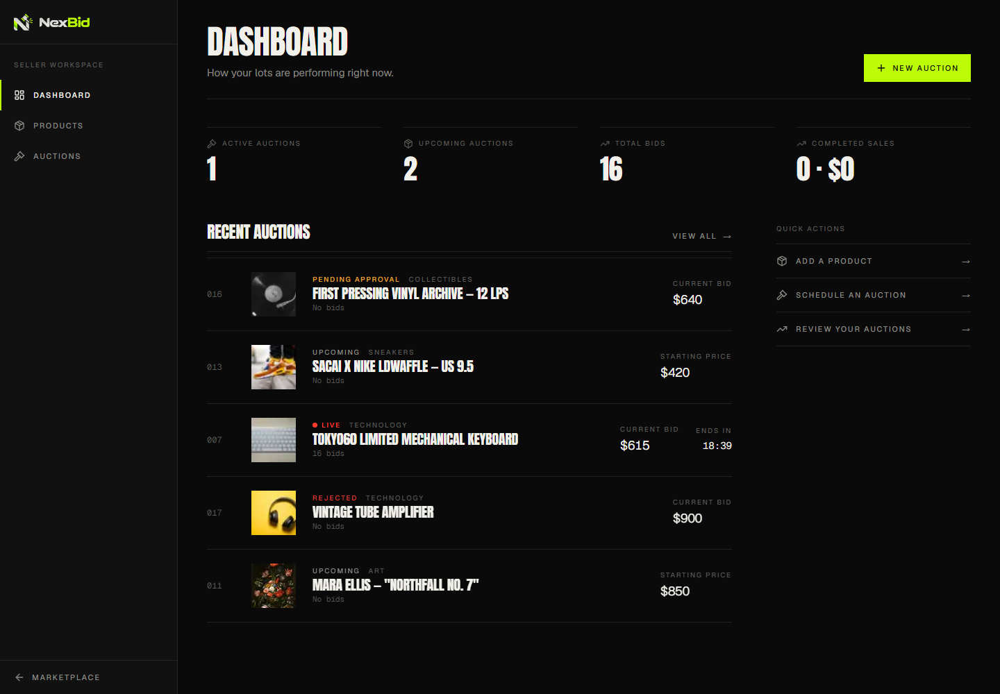
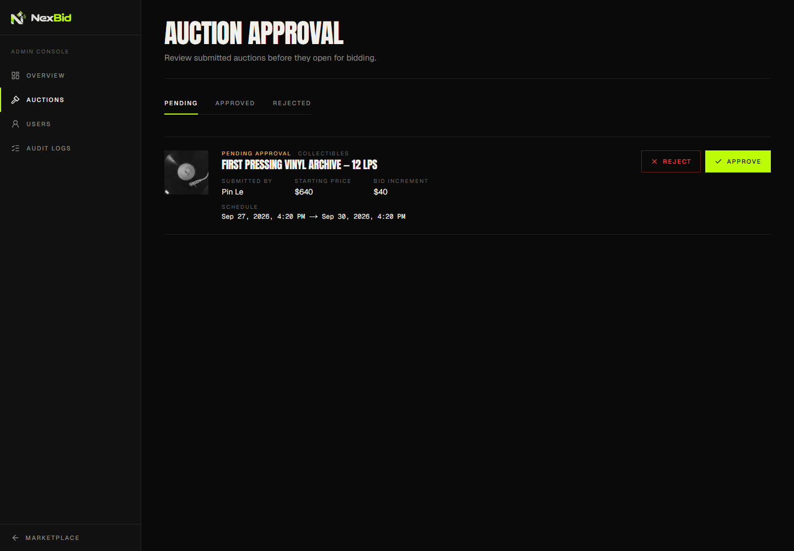
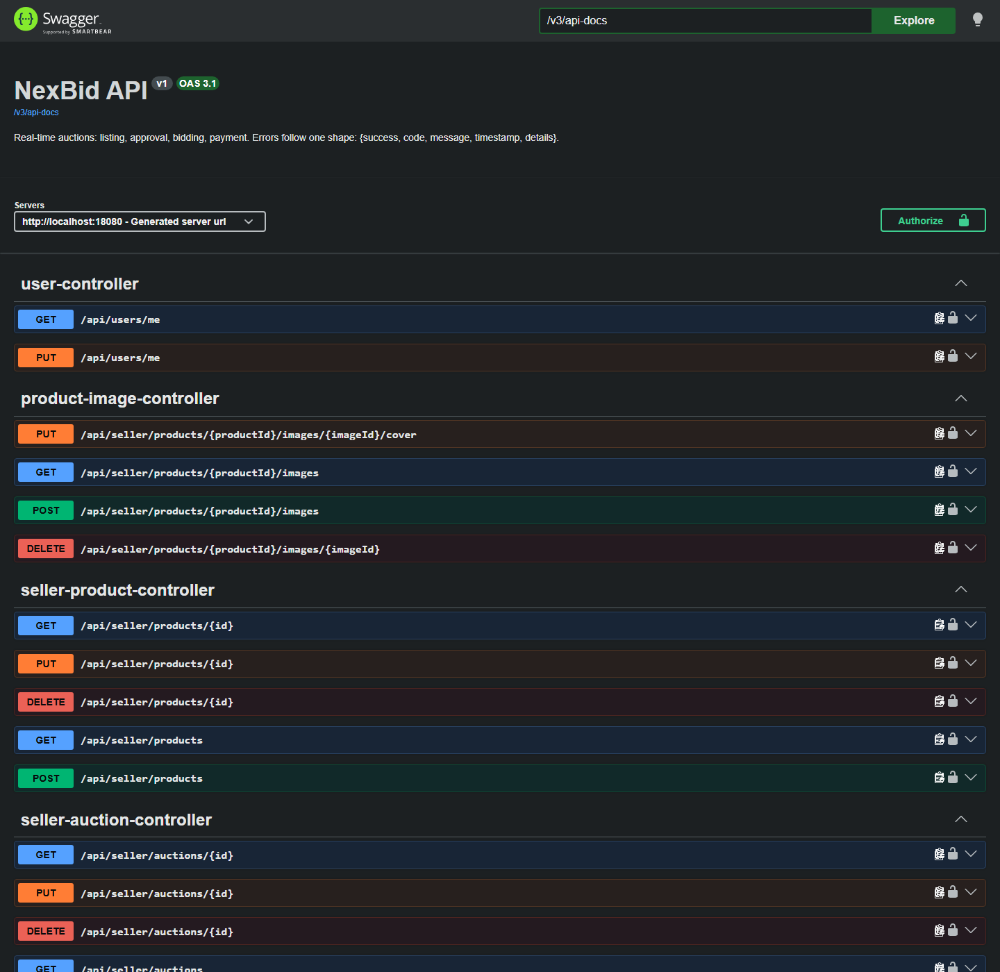
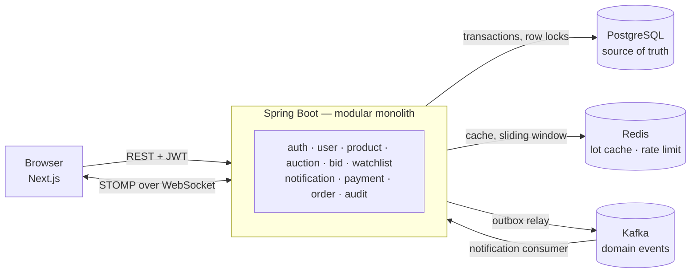
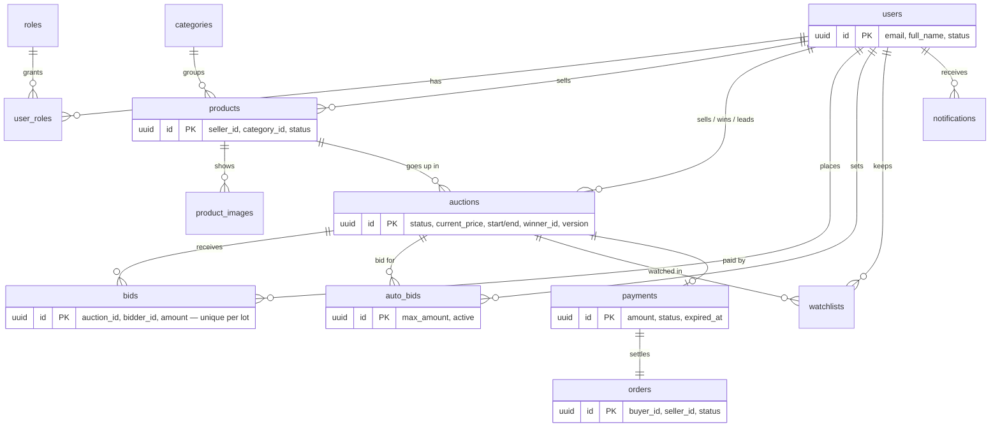
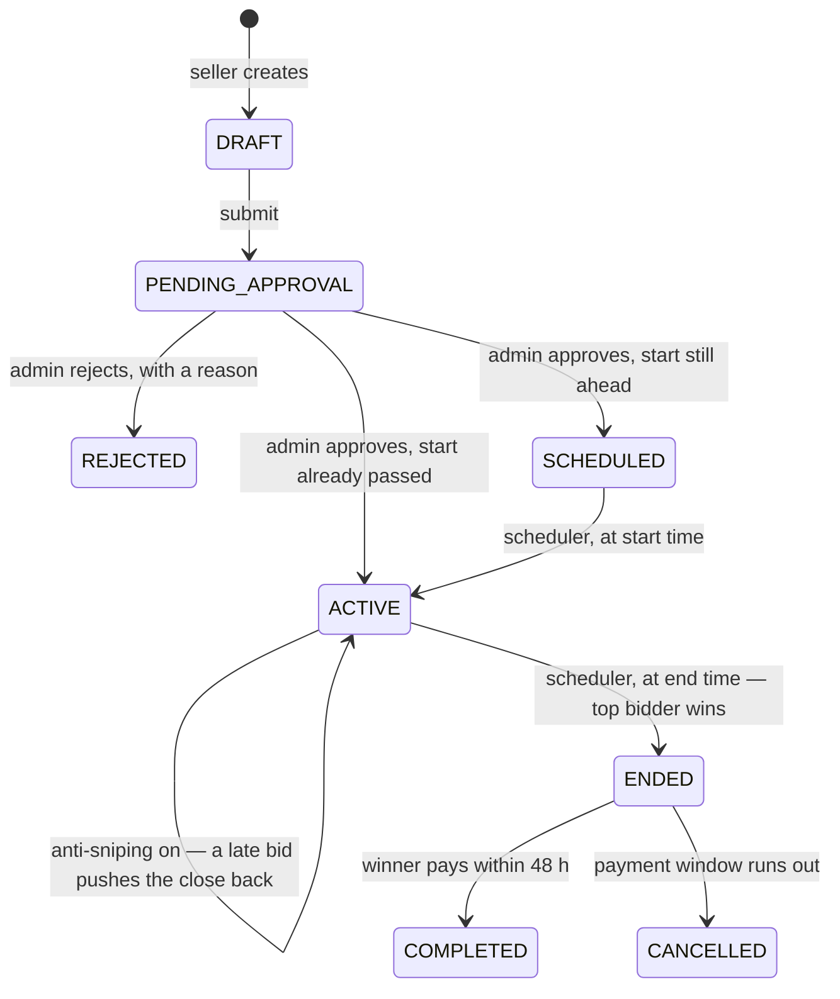
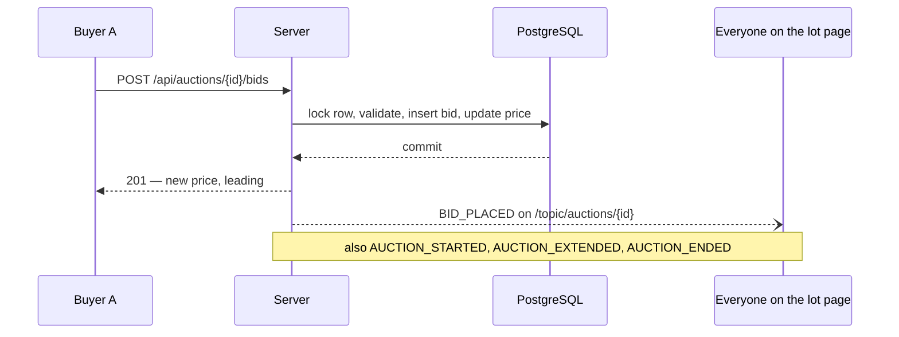
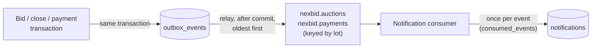

# NexBid

Real-time online auction platform. Sellers list lots, an admin approves them, buyers bid against a
server-owned clock, and the server decides everything that matters — the price, the close, the winner.
The interesting part is not the number of screens but getting the hard problems right: concurrent bids,
realtime updates, scheduling, caching, rate limiting and event delivery.

| | |
| --- | --- |
| Frontend | Complete, running on mock data |
| Backend | Complete — all 40 functions of the [implementation guide](docs/NexBid_Implementation_Guide_Step_By_Step.md) |

The frontend does not call the backend yet. The mock services mirror the REST contract, so switching to
the real API changes service bodies and nothing else.

---

## Screenshots

| | |
| --- | --- |
|  |  |
| Home | Lot page — current price, countdown, live bid feed |
|  |  |
| Seller dashboard | Admin approval queue |
|  |  |
| Swagger UI | Load test — bid latency from 10 to 1000 users |

---

## Tech stack

**Frontend** — Next.js 16, React 19, TypeScript, Tailwind CSS v4, shadcn/ui, next-intl (EN/VI),
next-themes.

**Backend** — Java 21, Spring Boot 4.1, Spring Data JPA, Spring Security (JWT), Spring WebSocket (STOMP),
Spring Modulith, Flyway, springdoc-openapi.

**Infrastructure** — PostgreSQL 17, Redis 7, Kafka 4 (KRaft), Docker Compose, k6, Testcontainers.

---

## Architecture

A modular monolith: one deployable, with module boundaries that Spring Modulith checks at build time
(`ModularityTest`), so a module can be split out later without a rewrite.



PostgreSQL is the only source of truth. Redis, WebSocket and Kafka each carry a copy of what the database
already committed; if any of them is down, bids still go through.

---

## ERD



Supporting tables without foreign keys on purpose: `audit_logs` (history must outlive the account),
`outbox_events` and `consumed_events` (Kafka delivery). The schema is in Flyway migrations
[`V1`–`V14`](backend/src/main/resources/db/migration).

---

## Auction flow



A scheduler opens and closes lots every few seconds, in batches, under the same row lock that bids take,
so a bid in flight at the closing second either lands before the close or is refused — never after. The
close opens a 48-hour payment for the winner (mock: `SUCCESS` or `FAILED`) together with a pending order,
and paying completes the sale. A seller can turn on anti-sniping per lot: a bid in the final seconds pushes
the close back. A lot with no bids ends with no winner and its product is free to be auctioned again.

---

## Concurrent bid handling

The rule every bid must pass — at least the current price plus the increment — is only true if nobody
else changes the price between reading and writing it. So the bid takes a row lock first:

1. `SELECT … FOR NO KEY UPDATE` on the auction row. Other bids on the same lot wait here.
2. Re-read the price and status under the lock; check seller, timing, minimum.
3. Insert the bid, move the price, record the leader, extend the close if inside the anti-sniping window.
4. Commit. Only now is anything announced.

Bids on different lots never wait for each other. A unique index on `(auction_id, amount)` and an
optimistic `version` column are the second and third line of defence. Auto bids answer inside the same
transaction, settling a whole exchange in one step and recording only its last two moves.

Proof, over real HTTP: [`ConcurrentBidHttpTest`](backend/src/test/java/com/nexbid/bid/ConcurrentBidHttpTest.java)
puts a lot at 20m with a 1m step and fires a hundred bids of 21m at once — exactly one 201, ninety-nine
422 `BID_TOO_LOW`, price 21m, one broadcast, one audit row, one outbid notice. Remove the lock and the
test fails with conflicts and 500s.

---

## Realtime flow



Broadcasts happen after commit, never during, so a browser can never see a price that a rollback takes
back. Clients may only subscribe; a client trying to publish on a lot topic is refused. Countdowns are
measured against `GET /api/server-time`, not the browser's clock.

---

## Redis

Two jobs, neither of them the source of truth:

- **Lot cache.** The parts of a lot that bidding never changes — name, photos, seller, category — are
  cached per lot for 10 minutes and evicted when the photos change. Price, status and end time always
  come from the database.
- **Rate limit.** At most 10 bid requests per person in any sliding 10-second window, counted by one
  atomic Lua script on Redis's own clock, so every instance shares one count. Over the limit: `429` with
  `Retry-After`.

If Redis is down, lots are served from the database and bids are not rate limited; one warning is logged
per back-off instead of a timeout on every request.

---

## Kafka



Events (`BidPlacedEvent`, `AuctionLifecycleEvent` for start / extend / end, `OutbidEvent`,
`PaymentEvents.Succeeded` / `Expired`) are marked `@Externalized` and written to an outbox table in the
same transaction as the change they describe. A relay hands them to Kafka after commit and deletes them
once acknowledged. A rolled-back bid never produces an event; a committed one always does; Kafka being
down only delays delivery. Events of one lot share a key, so they arrive in order. The consumer records
each event it handled in the same transaction as its work, so a redelivery does nothing. An event that
cannot be read is logged and skipped rather than blocking everything behind it.

---

## API docs

Swagger UI: http://localhost:8080/swagger-ui.html — sign in with `POST /api/auth/login` and paste the
`accessToken` into **Authorize**. The raw OpenAPI document is at `/v3/api-docs`.

| Area | Endpoints |
| --- | --- |
| Auth | `POST /api/auth/register`, `POST /api/auth/login` (JWT, 2 hours) |
| Catalogue | `GET /api/auctions`, `GET /api/auctions/{id}`, `GET /api/categories`, `GET /api/server-time` — public |
| Bidding | `POST /api/auctions/{id}/bids`, `GET /api/auctions/{id}/bids`, `/api/auctions/{id}/auto-bid` |
| Buyer | `/api/users/me`, `…/me/wins`, `…/me/payments`, `…/me/orders`, `…/me/watchlist`, `/api/notifications` |
| Seller | `/api/seller/products`, `/api/seller/products/{id}/images`, `/api/seller/auctions` |
| Admin | `/api/admin/auctions`, `/api/admin/categories`, `/api/admin/users/{id}/block`, `/api/admin/audit-logs` |
| Realtime | STOMP at `/ws`, topic `/topic/auctions/{id}` |

`/api/admin/**` needs the ADMIN role and `/api/seller/**` needs SELLER. The frontend hides those menus
too, but that is decoration — the server is what refuses.

Every endpoint answers in one of two shapes (spec §28), so the client needs one parser:

```json
{ "success": true, "message": "Bid placed", "data": { "currentPrice": 18500000 } }
```

```json
{ "success": false, "code": "BID_TOO_LOW", "message": "...", "timestamp": "..." }
```

`code` is the contract, `message` is for developers. The client translates the code, so a Vietnamese
bidder reads a Vietnamese reason for the same rejection. Both ends declare the same list —
[`ErrorCode.java`](backend/src/main/java/com/nexbid/common/exception/ErrorCode.java) and the `ErrorCode`
union in [`types/index.ts`](frontend/src/types/index.ts) — and they have to change together.

---

## Run

### Everything in Docker

```bash
docker compose up
```

Frontend at http://localhost:3000, backend at http://localhost:8080/api/health. The first run builds
both images and takes a few minutes; after changing code, run `docker compose up --build`. Postgres,
Redis and Kafka stay inside the compose network. If a dev server already holds 3000 or 8080, set
`NEXBID_FRONTEND_PORT` / `NEXBID_BACKEND_PORT`. To make an account admin, register it, then restart
the backend with `NEXBID_ADMIN_EMAILS=you@example.com docker compose up -d backend` and sign in again —
a token only carries the roles held when it was issued.

### Development

```bash
docker compose -f docker/compose.yaml up -d
```

```bash
cd backend && ./mvnw spring-boot:run
```

```bash
cd frontend && npm install && npm run dev
```

Frontend at http://localhost:3000 — works without the backend running.
Backend at http://localhost:8080/api/health

Postgres is published on port **55432**, Redis on **56379** and Kafka on **59092**, not the defaults —
see [`docker/compose.yaml`](docker/compose.yaml). The first admin cannot come from the public register
endpoint, so roles are granted at startup from configuration:

```bash
NEXBID_ADMIN_EMAILS=you@example.com ./mvnw spring-boot:run
```

---

## Testing

```bash
cd backend && ./mvnw test
```

```bash
cd frontend && npm run build
```

The backend suite needs Docker, not the dev services: each test context starts its own Postgres, Redis
and Kafka in containers. Highlights:

- [`AuctionFlowIntegrationTest`](backend/src/test/java/com/nexbid/AuctionFlowIntegrationTest.java) —
  one lot through the whole flow over real HTTP and WebSocket: listing, approval, the scheduler opening
  it, bids, the scheduler closing it, the winner paying, the audit trail.
- [`ConcurrentBidHttpTest`](backend/src/test/java/com/nexbid/bid/ConcurrentBidHttpTest.java) — a
  hundred simultaneous bids produce exactly one winner and no lost update.
- Kafka outage, Redis outage, duplicate delivery and rollback each have a test, and each test was checked
  by breaking the code it guards and watching it fail.

---

## Load test results

k6 against `docker compose up`, focusing on `POST /api/auctions/{id}/bids`. Latency in ms.

| Users | Requests/s | Bid p50 | Bid p95 | Bid p99 | Errors |
| ---: | ---: | ---: | ---: | ---: | ---: |
| 10 | 12.6 | 10.9 | 14.3 | 16.9 | 0.00% |
| 100 | 126.9 | 3.7 | 12.2 | 16.9 | 0.00% |
| 500 | 637.0 | 3.0 | 11.5 | 19.4 | 0.00% |
| 1000 | 1242.1 | 3.1 | 200.3 | 413.3 | 0.00% |

Every spec §31 target (bid p95 < 500 ms, lot page p95 < 300 ms) holds at 1000 users on one laptop. The
knee is between 500 and 1000 users, where 8 of the 10 pooled database connections were busy at the peak. Method,
all endpoints, database and Redis figures, and how to run it: [`docs/load-test`](docs/load-test/README.md).

---

## Docs

The specification and the step-by-step implementation guide are in [`docs/`](docs/).
