# NexBid

[](https://github.com/PinLee2409/NexBid/actions/workflows/ci.yml)

Real-time online auction platform. Sellers list lots, an admin approves them, buyers bid against a
server-owned clock, and the server decides everything that matters — the price, the close, the winner.
The interesting part is not the number of screens but getting the hard problems right: concurrent bids,
realtime updates, scheduling, caching, rate limiting and event delivery.

| | |
| --- | --- |
| Frontend | Complete, wired to the backend API and realtime socket |
| Backend | Complete — all 40 functions of the [implementation guide](docs/NexBid_Implementation_Guide_Step_By_Step.md) |

---

## Screenshots

Taken from the Docker stack with the [demo data](#demo-data) loaded.

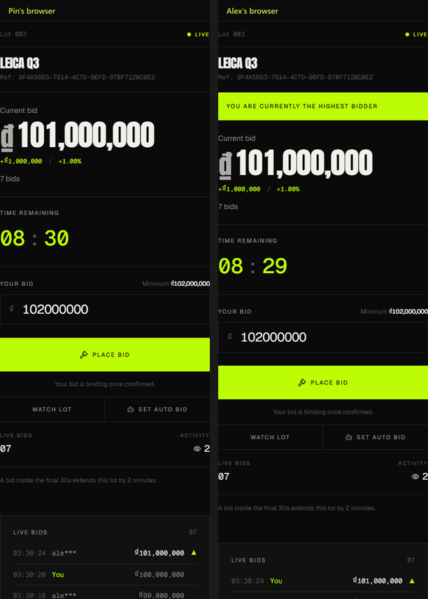

Two signed-in buyers on the same lot. Each bid reaches the other browser over the socket straight
away: the price, the bid feed, and the "You've been outbid" banner all update without a reload.

| | |
| --- | --- |
|  | 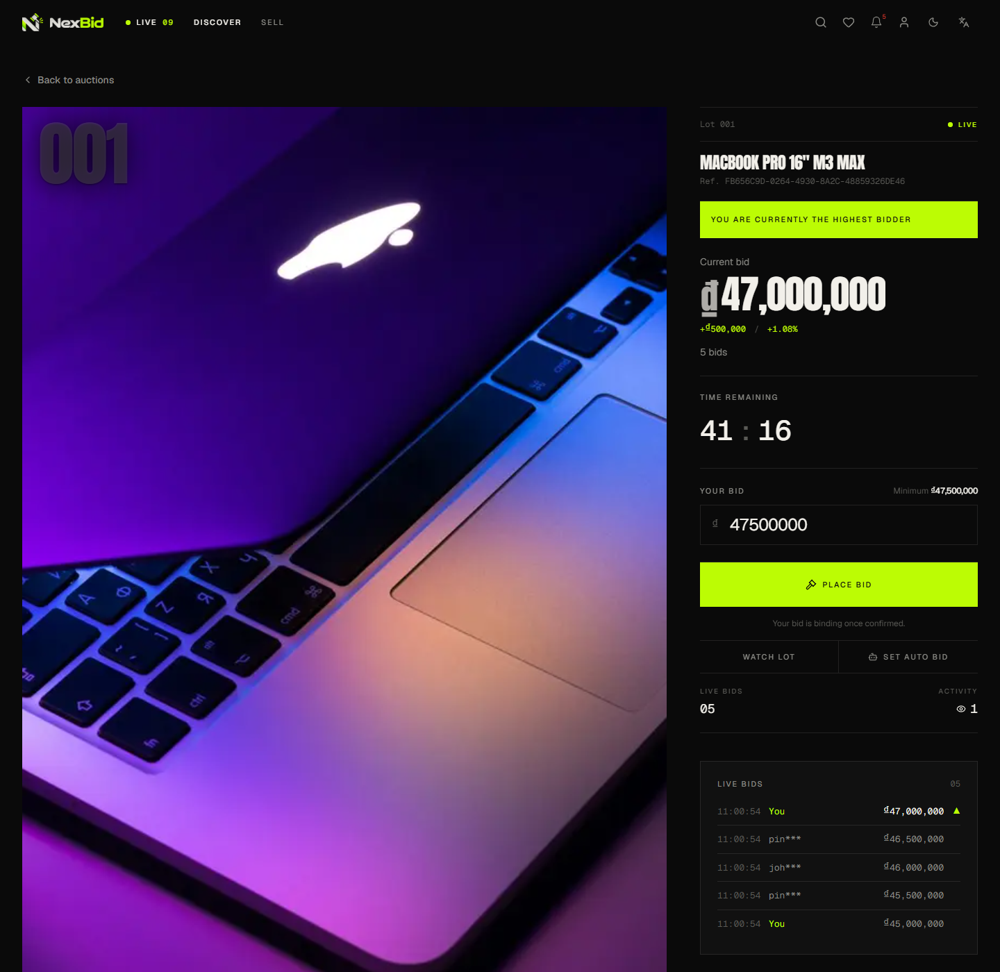 |
| Home | Lot page — current price, countdown, live bid feed |
| 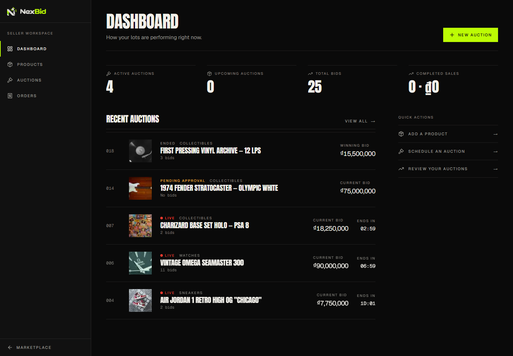 | 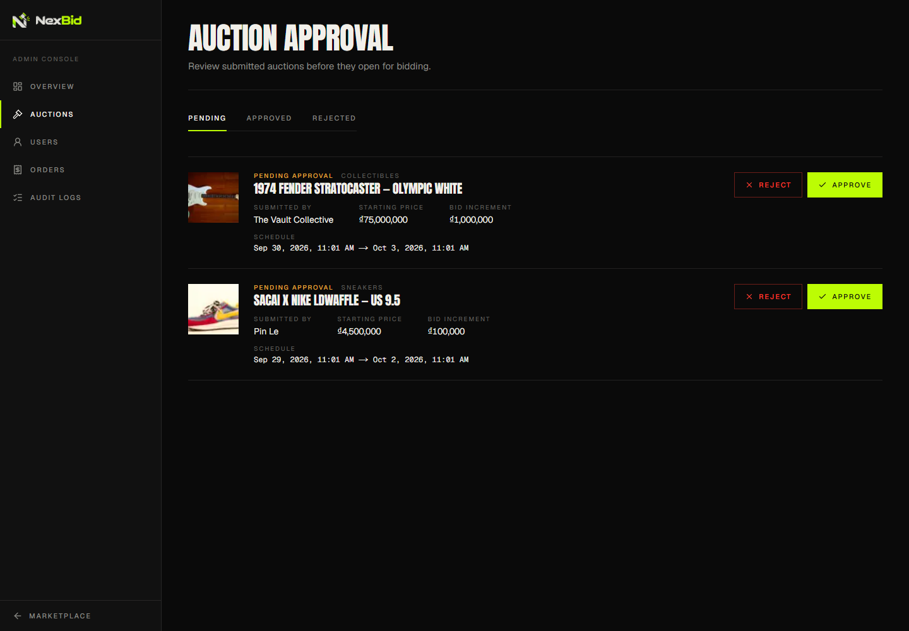 |
| Seller dashboard | Admin approval queue |
| 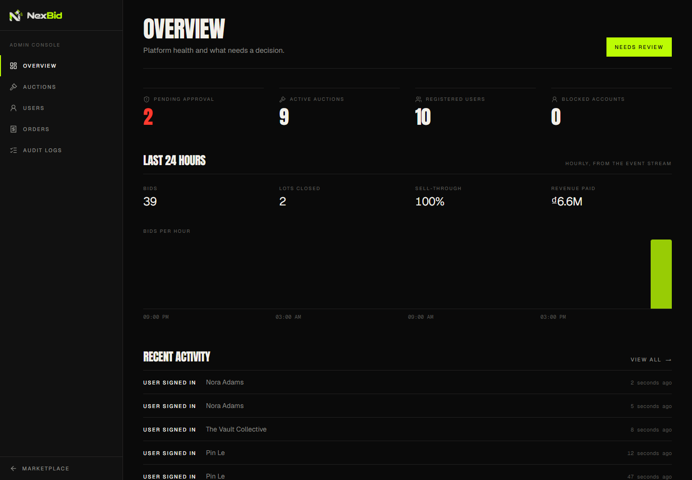 | 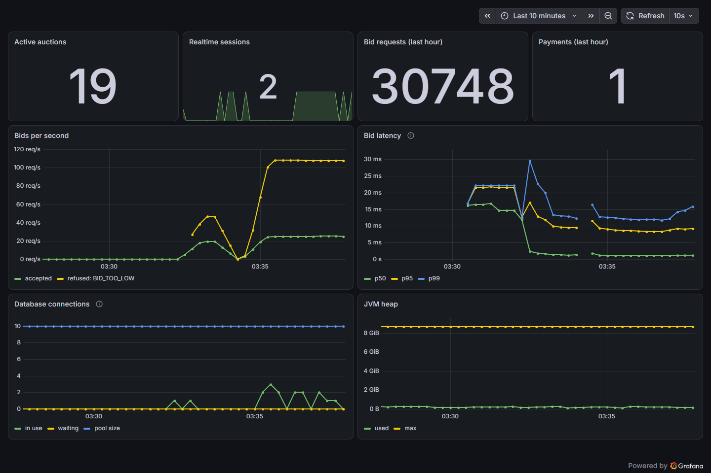 |
| Admin overview — hourly activity from the analytics consumer | Grafana during a k6 run at 200 users |
| 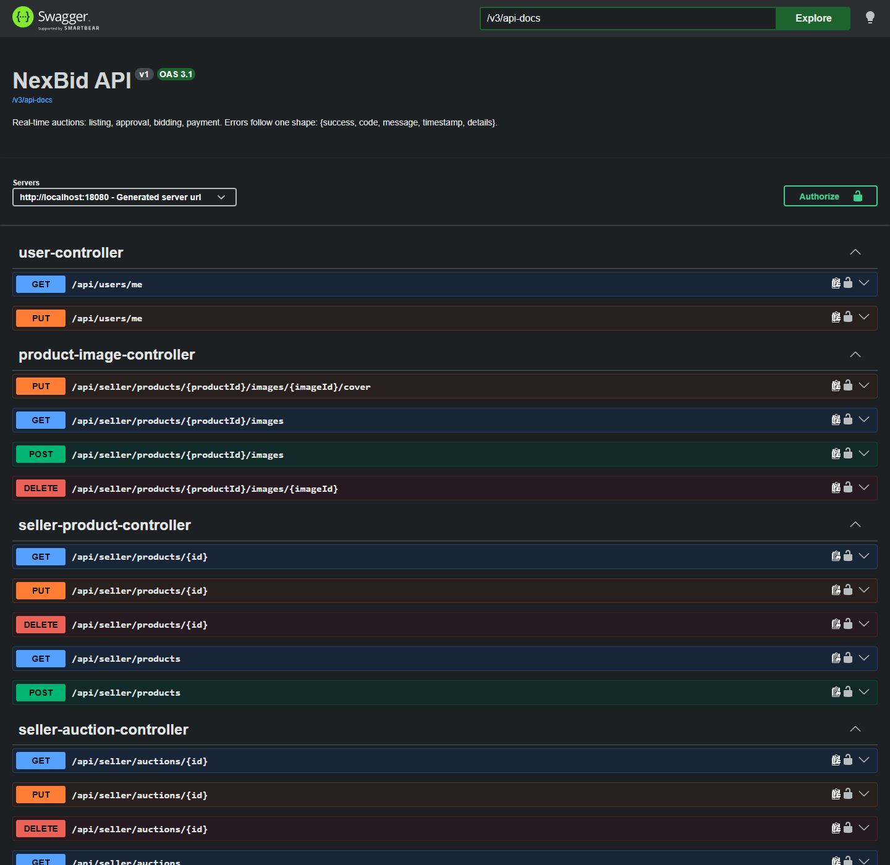 |  |
| Swagger UI | Load test — bid latency from 10 to 1000 users |

---

## Tech stack

**Frontend** — Next.js 16, React 19, TypeScript, Tailwind CSS v4, shadcn/ui, next-intl (EN/VI),
next-themes.

**Backend** — Java 21, Spring Boot 4.1, Spring Data JPA, Spring Security (JWT), Spring WebSocket (STOMP),
Spring Modulith, Flyway, springdoc-openapi.

**Infrastructure** — PostgreSQL 17, Redis 7, Kafka 4 (KRaft), Docker Compose, k6, Testcontainers.

---

## Architecture

A modular monolith: one deployable, with module boundaries that Spring Modulith checks at build time
(`ModularityTest`), so a module can be split out later without a rewrite.

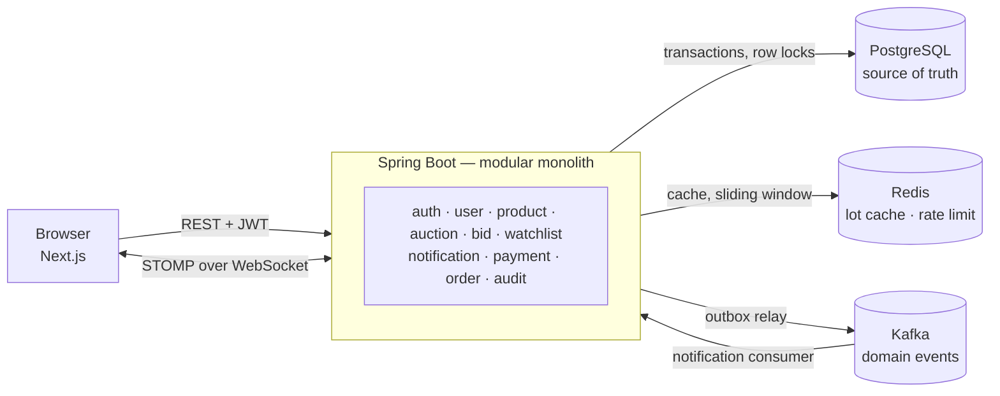
```mermaid
flowchart LR
    browser["Browser<br/>Next.js"]
    subgraph backend["Spring Boot — modular monolith"]
        direction TB
        modules["auth · user · product · auction · bid · watchlist<br/>notification · payment · order · audit"]
    end
    pg[("PostgreSQL<br/>source of truth")]
    redis[("Redis<br/>lot cache · rate limit")]
    kafka[("Kafka<br/>domain events")]

    browser -- "REST + JWT" --> backend
    browser <-- "STOMP over WebSocket" --> backend
    backend -- "transactions, row locks" --> pg
    backend -- "cache, sliding window" --> redis
    backend -- "outbox relay" --> kafka
    kafka -- "notification consumer" --> backend
```

PostgreSQL is the only source of truth. Redis, WebSocket and Kafka each carry a copy of what the database
already committed; if any of them is down, bids still go through.

The browser only talks to its own origin: Next.js rewrites `/api/*` and `/media/*` to the backend, so
there is no CORS setup. Server components render public pages straight from the backend, anonymously;
anything about the signed-in reader (their bids, watchlist, standing on a lot) is fetched in the browser
with the JWT. The realtime socket is the one direct connection from the browser to the backend.

---

## ERD

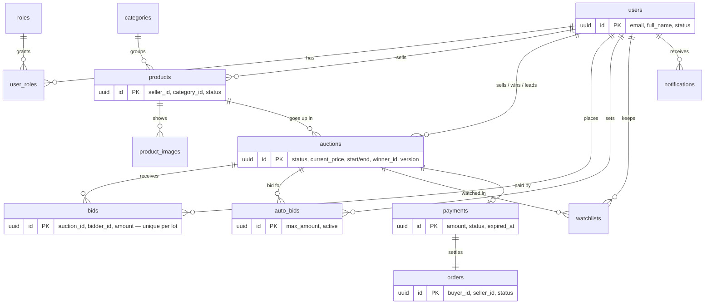
```mermaid
erDiagram
    users ||--o{ user_roles : has
    roles ||--o{ user_roles : grants
    users ||--o{ products : sells
    categories ||--o{ products : groups
    products ||--o{ product_images : shows
    products ||--o{ auctions : "goes up in"
    users ||--o{ auctions : "sells / wins / leads"
    auctions ||--o{ bids : receives
    users ||--o{ bids : places
    auctions ||--o{ auto_bids : "bid for"
    users ||--o{ auto_bids : sets
    auctions ||--o{ watchlists : "watched in"
    users ||--o{ watchlists : keeps
    users ||--o{ notifications : receives
    auctions ||--o| payments : "paid by"
    payments ||--|| orders : settles

    users {
        uuid id PK "email, full_name, status"
    }
    products {
        uuid id PK "seller_id, category_id, status"
    }
    auctions {
        uuid id PK "status, current_price, start/end, winner_id, version"
    }
    bids {
        uuid id PK "auction_id, bidder_id, amount — unique per lot"
    }
    auto_bids {
        uuid id PK "max_amount, active"
    }
    payments {
        uuid id PK "amount, status, expired_at"
    }
    orders {
        uuid id PK "buyer_id, seller_id, status"
    }
```

Supporting tables without foreign keys on purpose: `audit_logs` (history must outlive the account),
`outbox_events` and `consumed_events` (Kafka delivery). The schema is in Flyway migrations
[`V1`–`V14`](backend/src/main/resources/db/migration).

---

## Auction flow

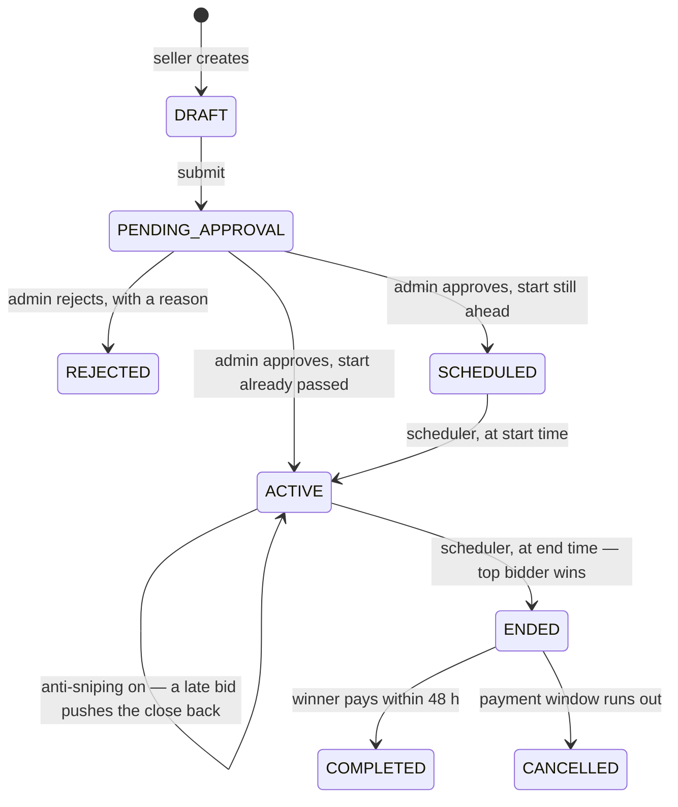
```mermaid
stateDiagram-v2
    [*] --> DRAFT: seller creates
    DRAFT --> PENDING_APPROVAL: submit
    PENDING_APPROVAL --> REJECTED: admin rejects, with a reason
    PENDING_APPROVAL --> SCHEDULED: admin approves, start still ahead
    PENDING_APPROVAL --> ACTIVE: admin approves, start already passed
    SCHEDULED --> ACTIVE: scheduler, at start time
    ACTIVE --> ACTIVE: anti-sniping on — a late bid pushes the close back
    ACTIVE --> ENDED: scheduler, at end time — top bidder wins
    ENDED --> COMPLETED: winner pays within 48 h
    ENDED --> CANCELLED: payment window runs out
```

A scheduler opens and closes lots every few seconds, in batches, under the same row lock that bids take,
so a bid in flight at the closing second either lands before the close or is refused — never after. The
close opens a 48-hour payment for the winner (mock: `SUCCESS` or `FAILED`) together with a pending order,
and paying completes the sale. A seller can turn on anti-sniping per lot: a bid in the final seconds pushes
the close back. A lot with no bids ends with no winner and its product is free to be auctioned again.

---

## Concurrent bid handling

The rule every bid must pass — at least the current price plus the increment — is only true if nobody
else changes the price between reading and writing it. So the bid takes a row lock first:

1. `SELECT … FOR NO KEY UPDATE` on the auction row. Other bids on the same lot wait here.
2. Re-read the price and status under the lock; check seller, timing, minimum.
3. Insert the bid, move the price, record the leader, extend the close if inside the anti-sniping window.
4. Commit. Only now is anything announced.

Bids on different lots never wait for each other. A unique index on `(auction_id, amount)` and an
optimistic `version` column are the second and third line of defence. Auto bids answer inside the same
transaction, settling a whole exchange in one step and recording only its last two moves.

Proof, over real HTTP: [`ConcurrentBidHttpTest`](backend/src/test/java/com/nexbid/bid/ConcurrentBidHttpTest.java)
puts a lot at 20m with a 1m step and fires a hundred bids of 21m at once — exactly one 201, ninety-nine
422 `BID_TOO_LOW`, price 21m, one broadcast, one audit row, one outbid notice. Remove the lock and the
test fails with conflicts and 500s.

---

## Realtime flow

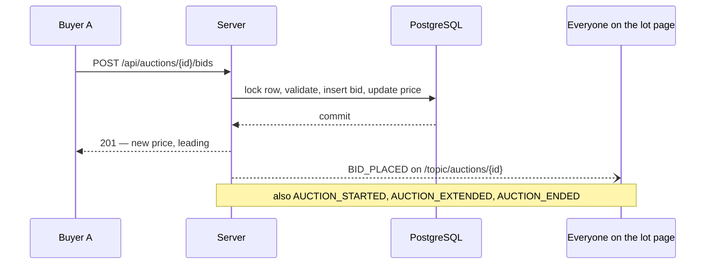
```mermaid
sequenceDiagram
    participant A as Buyer A
    participant S as Server
    participant DB as PostgreSQL
    participant P as Everyone on the lot page
    A->>S: POST /api/auctions/{id}/bids
    S->>DB: lock row, validate, insert bid, update price
    DB-->>S: commit
    S-->>A: 201 — new price, leading
    S--)P: BID_PLACED on /topic/auctions/{id}
    Note over S,P: also AUCTION_STARTED, AUCTION_EXTENDED, AUCTION_ENDED
```

Broadcasts happen after commit, never during, so a browser can never see a price that a rollback takes
back. Clients may only subscribe; a client trying to publish on a lot topic is refused. Countdowns are
measured against `GET /api/server-time`, not the browser's clock.

Lot topics are public, so an event never says who is leading from the reader's side. After each
`BID_PLACED` the page re-reads the lot's recent bids with the reader's token, and the `mine` flag on each
bid decides between "You're leading" and "You've been outbid".

A signed-in browser sends its token with STOMP `CONNECT` and listens on its own
`/user/queue/notifications`; each notice is pushed there after it commits, and an anonymous socket asking
for that queue is refused. Each lot page also hears `VIEWER_COUNT` at most once a second — one Redis set per
lot, one member per open socket subscription (spec §20.3).

---

## Sessions

A signed-in browser holds two tokens:
- an **access token** (JWT, 15 minutes) in localStorage, sent as `Authorization: Bearer` and with the
  socket's `CONNECT`;
- a **refresh token** in an `HttpOnly; Secure; SameSite=Strict` cookie scoped to `/api/auth`. Page scripts
  cannot read it, and other sites cannot make the browser send it.

`POST /api/auth/refresh` trades the cookie for a new access token and a new cookie. Each refresh token works
once: only its SHA-256 is stored, and a renewal replaces it with a new token of the same family. If a
replaced token ever comes back, a copy is loose, so the whole family is revoked and whoever holds it must
sign in again. A session lasts 7 days from its last use; without "Remember me" the cookie is dropped when
the browser closes. Signing out revokes that device's session. Blocking an account revokes all of its
sessions, in the same transaction as the block.

The frontend renews a minute before expiry, and retries a request once after a 401. Renewals run one at a
time across tabs (a Web Lock), so two tabs never present the same cookie; the new token reaches the other
tabs through the `storage` event. The socket reconnects only when the signed-in user changes, not on each
renewal.

Settings: `NEXBID_JWT_EXPIRY` (15m), `NEXBID_REFRESH_TTL` (7d), `NEXBID_REFRESH_COOKIE_SECURE` (true;
browsers accept a secure cookie on `http://localhost`, so set it to false only when serving plain HTTP on
another host).

---

## Security

- **Password guessing is slowed down.** Wrong passwords are counted in Redis over a sliding 15 minutes: 5 per
  email from one address, 20 per address across all emails. Past either, sign-in answers
  `429 LOGIN_RATE_LIMITED` with `Retry-After` — even to the right password, so the answer reveals nothing. A
  correct password clears its email-and-address count, and because the address is part of that count, nobody
  can lock someone else out from elsewhere. The client's address comes from `X-Forwarded-For`, trusted only
  from private addresses. Next.js passes that header on but never sets it, so in production the site must sit
  behind a reverse proxy (which HTTPS needs anyway) that does; without one — as with `docker compose up` on
  localhost — every browser looks like the frontend's own address.
- **Pages run only their own scripts.** Every page is served with a Content Security Policy carrying a fresh
  nonce (`src/proxy.ts`): scripts without it do not run, inline event handlers do not run, the page cannot be
  framed by another site, and it may connect only to itself and the realtime socket. Pages also send
  `nosniff`, `X-Frame-Options: DENY`, a strict `Referrer-Policy`, a `Permissions-Policy` and HSTS; the
  backend's answers carry Spring Security's equivalents.
- **Production refuses unsafe settings.** With `SPRING_PROFILES_ACTIVE=prod` the backend will not start on a
  JWT secret shipped in this repository or shorter than 32 bytes, or with a refresh cookie allowed over plain
  HTTP, and it stops publishing Swagger UI and `/v3/api-docs`. Without the profile — `docker compose up`, the
  dev setup — nothing needs configuring.

Settings: `NEXBID_LOGIN_ACCOUNT_LIMIT` (5), `NEXBID_LOGIN_ADDRESS_LIMIT` (20), `NEXBID_LOGIN_WINDOW` (15m).

---

## Redis

Two jobs, neither of them the source of truth:

- **Lot cache.** The parts of a lot that bidding never changes — name, photos, seller, category — are
  cached per lot for 10 minutes and evicted when the photos change. Price, status and end time always
  come from the database.
- **Rate limit.** At most 10 bid requests per person in any sliding 10-second window, counted by one
  atomic Lua script on Redis's own clock, so every instance shares one count. Over the limit: `429` with
  `Retry-After`.

If Redis is down, lots are served from the database and bids are not rate limited; one warning is logged
per back-off instead of a timeout on every request.

---

## Kafka

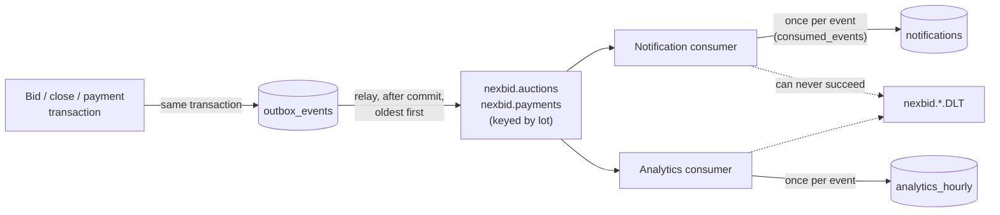
```mermaid
flowchart LR
    tx["Bid / close / payment<br/>transaction"] -- "same transaction" --> outbox[("outbox_events")]
    outbox -- "relay, after commit,<br/>oldest first" --> topics["nexbid.auctions<br/>nexbid.payments<br/>(keyed by lot)"]
    topics --> consumer["Notification consumer"]
    consumer -- "once per event<br/>(consumed_events)" --> notices[("notifications")]
    topics --> analytics["Analytics consumer"]
    analytics -- "once per event" --> hourly[("analytics_hourly")]
    consumer -. "can never succeed" .-> dlt["nexbid.*.DLT"]
    analytics -.-> dlt
```

Events (`BidPlacedEvent`, `AuctionLifecycleEvent` for start / extend / end, `OutbidEvent`,
`PaymentEvents.Succeeded` / `Expired`) are marked `@Externalized` and written to an outbox table in the
same transaction as the change they describe. A relay hands them to Kafka after commit and deletes them
once acknowledged. A rolled-back bid never produces an event; a committed one always does; Kafka being
down only delays delivery. Events of one lot share a key, so they arrive in order. The consumer records
each event it handled in the same transaction as its work, so a redelivery does nothing. An event that
cannot be read, or that the database refuses outright (a user it does not have), is logged and parked on
the topic's dead-letter twin (`nexbid.auctions.DLT`, `nexbid.payments.DLT`) rather than blocking
everything behind it; any other failure is retried until it clears.

Two consumer groups read the same topics independently (spec §19). The notification consumer writes the
bell; the analytics consumer adds each bid, close and payment into hourly totals, which the admin overview
charts for the last 24 hours (`GET /api/admin/analytics`). Audit entries are written inside the original
transaction instead of by a consumer, so they can never disagree with the data.

---

## API docs

Swagger UI: http://localhost:8080/swagger-ui.html — sign in with `POST /api/auth/login` and paste the
`accessToken` into **Authorize**. The raw OpenAPI document is at `/v3/api-docs`.

| Area | Endpoints |
| --- | --- |
| Auth | `POST /api/auth/register`, `POST /api/auth/login` (JWT for 15 minutes + refresh cookie), `POST /api/auth/refresh`, `POST /api/auth/logout` |
| Catalogue | `GET /api/auctions`, `GET /api/auctions/{id}`, `GET /api/categories`, `GET /api/server-time` — public |
| Bidding | `POST /api/auctions/{id}/bids`, `GET /api/auctions/{id}/bids`, `/api/auctions/{id}/auto-bid` |
| Buyer | `/api/users/me`, `…/me/bids`, `…/me/wins`, `…/me/payments`, `…/me/orders` (`…/{id}/received`), `…/me/watchlist`, `/api/notifications` |
| Seller | `/api/seller/products`, `/api/seller/products/{id}/images`, `/api/seller/auctions`, `/api/seller/orders` (`…/{id}/ship`) |
| Admin | `/api/admin/auctions`, `/api/admin/categories`, `/api/admin/users`, `/api/admin/users/{id}/block`, `/api/admin/orders` (`…/{id}/refund`), `/api/admin/analytics`, `/api/admin/audit-logs` |
| Realtime | STOMP at `/ws`: `/topic/auctions/{id}` for everyone, `/user/queue/notifications` for the signed-in user |

`/api/admin/**` needs the ADMIN role and `/api/seller/**` needs SELLER. The frontend hides those menus
too, but that is decoration — the server is what refuses.

Every endpoint answers in one of two shapes (spec §28), so the client needs one parser:

```json
{ "success": true, "message": "Bid placed", "data": { "currentPrice": 18500000 } }
```

```json
{ "success": false, "code": "BID_TOO_LOW", "message": "...", "timestamp": "..." }
```

`code` is the contract, `message` is for developers. The client translates the code, so a Vietnamese
bidder reads a Vietnamese reason for the same rejection. Both ends declare the same list —
[`ErrorCode.java`](backend/src/main/java/com/nexbid/common/exception/ErrorCode.java) and the `ErrorCode`
union in [`types/index.ts`](frontend/src/types/index.ts) — and they have to change together.

---

## Run

### Everything in Docker

```bash
docker compose up
```

Frontend at http://localhost:3000, backend at http://localhost:8080/api/health. The first run builds
both images and takes a few minutes; after changing code, run `docker compose up --build`. Postgres,
Redis and Kafka stay inside the compose network. If a dev server already holds 3000 or 8080, set
`NEXBID_FRONTEND_PORT` / `NEXBID_BACKEND_PORT`. To make an account admin, register it, then restart
the backend with `NEXBID_ADMIN_EMAILS=you@example.com docker compose up -d backend` and sign in again (or
wait for the next token renewal, at most 15 minutes) — a token only carries the roles held when it was issued.

### Development

```bash
docker compose -f docker/compose.yaml up -d
```

```bash
cd backend && ./mvnw spring-boot:run
```

```bash
cd frontend && npm install && npm run dev
```

Frontend at http://localhost:3000, backend at http://localhost:8080/api/health. The frontend expects the
backend on 8080; to point it elsewhere, copy [`frontend/.env.example`](frontend/.env.example) to
`frontend/.env.local` and change `NEXBID_API_URL` and `NEXT_PUBLIC_WS_URL`.

Postgres is published on port **55432**, Redis on **56379** and Kafka on **59092**, not the defaults —
see [`docker/compose.yaml`](docker/compose.yaml). The first admin cannot come from the public register
endpoint, so roles are granted at startup from configuration:

```bash
NEXBID_ADMIN_EMAILS=you@example.com ./mvnw spring-boot:run
```

### Demo data

With the backend running on an empty database:

```bash
node docs/demo/seed.mjs
```

[`docs/demo/seed.mjs`](docs/demo/seed.mjs) builds a catalogue of 18 lots with real photos (downloaded from
Unsplash): nine live lots mid-bidding, lots opening later, an approval queue, a rejection, a draft, and two
lots that close while it runs — one paid, one waiting for payment. It takes about a minute. Everything goes
through the API, so bids, auto bids, notifications, payments and the audit log are real; only the SELLER
and ADMIN roles are granted in SQL. Against the Docker stack, run it with `STACK=docker`.

Every account's password is `nexbid-demo`. Sign in as **pin@nexbid.test** (bids, an auto bid, wins,
watchlist and own listings) or **admin@nexbid.test** (approvals, users, audit log). Sellers are
`atelier@`, `vault@` and `lumen@nexbid.test`; `alex@`, `john@`, `mika@`, `sara@` and `dmitri@` bid
against you.

To start over, stop the backend, wipe the dev services and uploaded photos, start the backend again (Flyway
recreates the schema), then seed:

```bash
docker compose -f docker/compose.yaml down -v && docker compose -f docker/compose.yaml up -d
```

```bash
rm -f backend/var/images/*
```

### Monitoring

```bash
docker compose --profile monitoring up
```

Adds Prometheus (http://localhost:9090) and Grafana (http://localhost:3001, viewable without signing in)
with a provisioned dashboard: the metrics of spec §34 — `bid_requests_total`, `bid_success_total`,
`bid_failed_total` by reason, `bid_latency` (p50 / p95 / p99), `active_auctions`,
`websocket_connections`, `payment_success_total` — plus the database pool the load test found to be the
bottleneck. In the Docker stack the backend serves health and metrics on port 8090, which is never
published, so only Prometheus inside the network can read them.

---

## Testing

```bash
cd backend && ./mvnw test
```

```bash
cd frontend && npm test
```

```bash
cd frontend && npm run test:coverage
```

The backend suite needs Docker, not the dev services: each test context starts its own Postgres, Redis
and Kafka in containers. Highlights:

- [`AuctionFlowIntegrationTest`](backend/src/test/java/com/nexbid/AuctionFlowIntegrationTest.java) —
  one lot through the whole flow over real HTTP and WebSocket: listing, approval, the scheduler opening
  it, bids, the scheduler closing it, the winner paying, the audit trail.
- [`ConcurrentBidHttpTest`](backend/src/test/java/com/nexbid/bid/ConcurrentBidHttpTest.java) — a
  hundred simultaneous bids produce exactly one winner and no lost update.
- Kafka outage, Redis outage, duplicate delivery and rollback each have a test, and each test was checked
  by breaking the code it guards and watching it fail.

### Frontend unit tests

[Vitest](https://vitest.dev) covers the frontend's own logic, next to the code it checks (`src/**/*.test.ts`):
the bid rules the panel applies before a request is sent (spec §7.8, §8, §13, §14), prices and countdowns,
the browse filters kept in the URL, name masking, and the session code — when the HTTP client renews the
access token, retries once after a 401, or gives up and signs the user out. They run in about a second and
need no backend.

They also keep the English and Vietnamese message catalogues in step: the same keys, the same placeholders
in each translation, and a message for every error code — and the frontend's list of error codes must match
the backend's `ErrorCode` enum, so the two cannot drift apart. [knip](https://knip.dev) (`npm run knip`) fails
on unused files, exports and dependencies.

### Coverage

| | Lines | Branches | Measured on |
| --- | --- | --- | --- |
| Backend (JaCoCo) | 94.7% | 80.2% | everything, across 215 classes |
| Frontend unit (Vitest) | 97.5% | 87.7% | the logic layer: `src/lib`, `src/services/api` |

Frontend components and the thin service wrappers around `fetch` are covered by the end-to-end suite rather
than unit tests. Each figure has a floor a little below it (backend 90% / 75%, frontend 90% / 80%), so a real
drop fails CI; every run also posts its figures on the run's page and keeps the HTML reports
(`target/site/jacoco`, `frontend/coverage`) as artifacts.

### End-to-end tests

[Playwright](frontend/e2e) drives the real app in Chromium against a running stack:
- a visitor finds a lot and is asked to sign in;
- sign-in, a wrong password, and registration;
- two buyers on the same lot, each seeing the other's bid and the "outbid" banner without a reload;
- the minimum-bid check;
- an admin approving a lot;
- times shown in the reader's own time zone;
- every page, for every role, checked with [axe](https://github.com/dequelabs/axe-core) against WCAG 2.1 AA in
  both themes;
- every page at 375 px wide: nothing wider than the screen, and a bid placed from a phone;
- no test passes if a page it opened logged a console error, a hydration mismatch or an uncaught exception.

Each run creates its own accounts and lots, with a run id in every name, so it can run again on the same
database.

```bash
docker compose up -d --build --wait
```

```bash
cd frontend && npx playwright install chromium && npm run test:e2e
```

Setup grants the seller and admin roles through `docker compose exec postgres`, as the demo seed does. Point
the tests elsewhere with `E2E_WEB_URL`, `E2E_API_URL` and `E2E_COMPOSE_FILE` (relative to `frontend/`, e.g.
`../docker/compose.yaml` for the dev services). `E2E_BROWSER_CHANNEL=chrome` uses an installed Chrome
instead of downloading Chromium.

### CI/CD

[`.github/workflows/ci.yml`](.github/workflows/ci.yml) runs on every push and pull request: the full
backend suite (`./mvnw verify`, with Testcontainers on the runner's Docker, and its coverage floor); `tsc`,
ESLint, knip, the unit tests with their coverage floor, and `next build` for the frontend; the end-to-end tests against `docker compose up`; then both Docker images are
built. A push to `main` publishes the images once everything above passed:

```bash
docker pull ghcr.io/pinlee2409/nexbid-backend:latest
```

```bash
docker pull ghcr.io/pinlee2409/nexbid-frontend:latest
```

Images are tagged `latest` and with the commit (`sha-<short>`). The frontend image is built for the
Compose stack: pages reach the backend at `http://backend:8080` and the browser opens the socket on
`ws://localhost:8080/ws`.

---

## Load test results

k6 against `docker compose up`, focusing on `POST /api/auctions/{id}/bids`. Latency in ms.

| Users | Requests/s | Bid p50 | Bid p95 | Bid p99 | Errors |
| ---: | ---: | ---: | ---: | ---: | ---: |
| 10 | 12.6 | 15.2 | 26.0 | 36.0 | 0.00% |
| 100 | 127.1 | 3.5 | 13.3 | 18.0 | 0.00% |
| 500 | 637.9 | 2.1 | 9.3 | 13.6 | 0.00% |
| 1000 | 1270.6 | 2.1 | 9.3 | 27.1 | 0.00% |

Every spec §31 target (bid p95 < 500 ms, lot page p95 < 300 ms) holds at 1000 users on one laptop, by a
wide margin. The first run had a knee between 500 and 1000 users — bid p95 200 ms, 8 of 10 database
connections busy — caused by looking the account up on every request; caching that check for a few seconds
removed it. Method, all endpoints, database and Redis figures, and how to run it:
[`docs/load-test`](docs/load-test/README.md).

### Frontend performance

Lighthouse 13 on the production build (`docker compose up`, demo data), mobile profile — simulated slow
4G and a 4× slower CPU — median of three runs:

| Page | Performance | LCP | Total blocking time | Page weight | Accessibility |
| --- | --- | --- | --- | --- | --- |
| Home | 77 → 83 | 6.0 → 4.7 s | 150 → 48 ms | 1012 → 711 KiB | 96 → 100 |
| Discover | 82 → 87 | 4.9 → 4.0 s | 61 → 38 ms | 1017 → 697 KiB | 98 → 100 |
| Lot page | 83 → 88 | 4.7 → 3.7 s | 61 → 27 ms | 878 → 636 KiB | 100 |
| Sign in | 85 → 91 | 4.3 → 3.5 s | 42 → 33 ms | 767 → 508 KiB | 100 |

Desktop scores 99–100 on every page, before and after; layout shift is 0 everywhere. What moved the numbers:
the logo was being fetched at 1920 and 3840 px wide for a 30 px mark (and its hidden light/dark twin with
it); photos are served as AVIF; each page's largest image is fetched with `fetchpriority=high` and nothing
else claims priority; fonts are no longer preloaded (a preload fetched the Vietnamese subset on English pages
too), with metric-matched fallbacks filling in; framer-motion loads only the features the app uses
(`LazyMotion`); the home page reads its showcase and editorial lots in parallel. Most of what remains on
mobile is JavaScript: about 290 KiB, a third of it React itself.

---

## Docs

[`docs/decisions.md`](docs/decisions.md) explains the main design choices — concurrency, the event outbox,
sessions, security, testing — with what each costs and the test that proves it.

The specification and the step-by-step implementation guide are in [`docs/`](docs/). What the specification
asks for beyond the 40 guide functions is tracked in [`docs/NexBid_Backlog.md`](docs/NexBid_Backlog.md).
